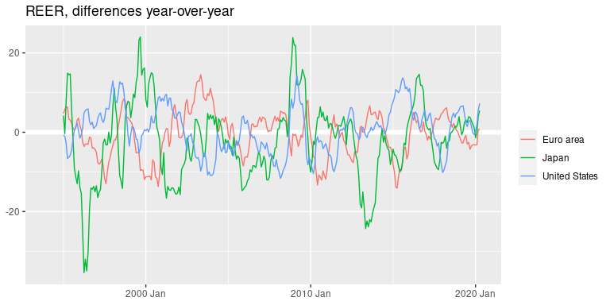
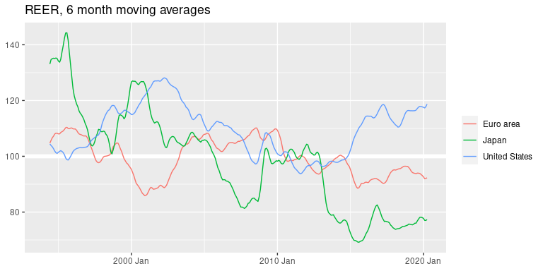
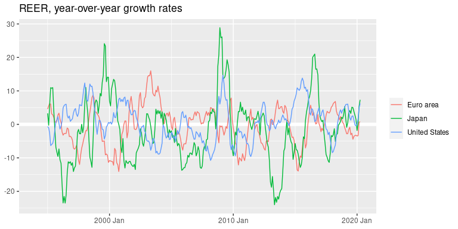
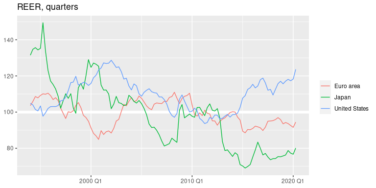
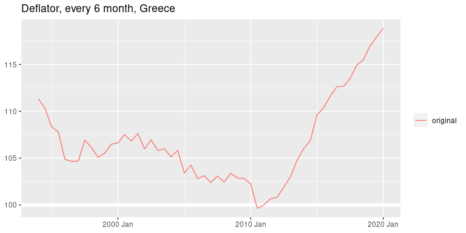

Introduction to tqr package
================
Mitsuo Shiota
2019-07-19

  - [tqr: add-on to tsibble, inspired by
    tidyquant](#tqr-add-on-to-tsibble-inspired-by-tidyquant)
      - [Installation](#installation)
      - [Libraries](#libraries)
      - [Create time aware dataframe of tsibble
        class](#create-time-aware-dataframe-of-tsibble-class)
      - [Insert missing rows, if
        necessary](#insert-missing-rows-if-necessary)
      - [tq\_diff: calculate
        differences](#tq_diff-calculate-differences)
      - [tq\_ma: calculate moving
        averages](#tq_ma-calculate-moving-averages)
      - [tq\_gr: calculate growth rates](#tq_gr-calculate-growth-rates)
      - [Convert to lower frequency](#convert-to-lower-frequency)
      - [tq\_sa: calculate seasonally adjusted
        values](#tq_sa-calculate-seasonally-adjusted-values)
      - [cal\_factory: function factory for
        calculation](#cal_factory-function-factory-for-calculation)
      - [cal\_factory\_zoo: function factory for calculation utilizing
        zoo
        package](#cal_factory_zoo-function-factory-for-calculation-utilizing-zoo-package)
      - [cal\_factory\_ts: function factory for calculation utilizing ts
        class](#cal_factory_ts-function-factory-for-calculation-utilizing-ts-class)
      - [cal\_factory\_xts: function factory for calculation utilizing
        xts
        package](#cal_factory_xts-function-factory-for-calculation-utilizing-xts-package)

<!-- README.md is generated from README.Rmd. Please edit that file -->

<!-- badges: start -->

[](https://travis-ci.org/mitsuoxv/tqr)
<!-- badges: end -->

Updated: 2020-12-24

# tqr: add-on to tsibble, inspired by tidyquant

When I utilize [`tidyquant`
package](https://cran.r-project.org/web/packages/tidyquant/readme/README.html)
for economic analyses, I often find myself writing similar functions
repeatedly. I also find the idea of time aware dataframe of [`tsibble`
package](https://cran.r-project.org/web/packages/tsibble/index.html) may
help me deal with time series data more confidently. So I have decided
to build this package to facilitate my work.

`tqr` package adds functions:

1.  tq\_diff: calculate differences
2.  tq\_ma: calculate moving averages
3.  tq\_gr: calculate growth rates
4.  tq\_sa: calculate seasonally adjusted values
5.  cal\_factory: function factory for calculation
6.  cal\_factory\_zoo: function factory for calculation utilizing zoo
    package
7.  cal\_factory\_ts: function factory for calculation utilizing ts
    class
8.  cal\_factory\_xts: function factory for calculation utilizing xts
    package

## Installation

This package is only for my own use for now. “You” means “future me”.

You can install the development version with:

``` r
remotes::install_github("mitsuoxv/tqr")
```

## Libraries

``` r
library(tidyverse)
library(tsibble)
library(tqr)
```

## Create time aware dataframe of tsibble class

I use monthly effective exchange rate indices of 60 countries, which BIS
publishes on [its site](https://www.bis.org/statistics/eer.htm).
`symbol` column is “reer” (real effective exchange rate), “neer”
(nominal effective exchange rate) or “deflator”, which I calculated as
“neer” / “reer” \* 100. I prepared `eer` as a tibble.

``` r
eer
#> # A tibble: 948 x 62
#>    date       symbol Algeria Argentina Australia Austria Belgium Brazil Bulgaria
#>    <date>     <chr>    <dbl>     <dbl>     <dbl>   <dbl>   <dbl>  <dbl>    <dbl>
#>  1 1994-01-31 defla…    152.      84.2      106.    84.3    88.8  1336.    6021.
#>  2 1994-02-28 defla…    147.      91.7      107.    84.5    89.2   957.    5858.
#>  3 1994-03-31 defla…    144.     100.       107.    84.6    89.7   673.    5515.
#>  4 1994-04-30 defla…    142.     109.       107.    85.1    90.1   474.    4632.
#>  5 1994-05-31 defla…    135.     119.       108.    85.4    90.3   330.    4350.
#>  6 1994-06-30 defla…    134.     130.       108.    85.6    90.4   224.    4222.
#>  7 1994-07-31 defla…    133.     131.       108.    84.8    90.1   211.    4218.
#>  8 1994-08-31 defla…    129.     132.       108.    84.7    90.3   208.    4038.
#>  9 1994-09-30 defla…    123.     132.       108.    85.6    90.8   205.    3690.
#> 10 1994-10-31 defla…    121.     133.       108.    86.2    91.2   201.    3512.
#> # … with 938 more rows, and 53 more variables: Canada <dbl>, Chile <dbl>,
#> #   China <dbl>, `Chinese Taipei` <dbl>, Colombia <dbl>, Croatia <dbl>,
#> #   Cyprus <dbl>, `Czech Republic` <dbl>, Denmark <dbl>, Estonia <dbl>, `Euro
#> #   area` <dbl>, Finland <dbl>, France <dbl>, Germany <dbl>, Greece <dbl>,
#> #   `Hong Kong SAR` <dbl>, Hungary <dbl>, Iceland <dbl>, India <dbl>,
#> #   Indonesia <dbl>, Ireland <dbl>, Israel <dbl>, Italy <dbl>, Japan <dbl>,
#> #   Korea <dbl>, Latvia <dbl>, Lithuania <dbl>, Luxembourg <dbl>,
#> #   Malaysia <dbl>, Malta <dbl>, Mexico <dbl>, Netherlands <dbl>, `New
#> #   Zealand` <dbl>, Norway <dbl>, Peru <dbl>, Philippines <dbl>, Poland <dbl>,
#> #   Portugal <dbl>, Romania <dbl>, Russia <dbl>, `Saudi Arabia` <dbl>,
#> #   Singapore <dbl>, Slovakia <dbl>, Slovenia <dbl>, `South Africa` <dbl>,
#> #   Spain <dbl>, Sweden <dbl>, Switzerland <dbl>, Thailand <dbl>, Turkey <dbl>,
#> #   `United Arab Emirates` <dbl>, `United Kingdom` <dbl>, `United States` <dbl>

class(eer)
#> [1] "tbl_df"     "tbl"        "data.frame"
```

I transform `eer` from a tibble to a tsibble (`tbl_ts` class) by making
clear that `date` is monthly, and by specifying `key` (category of
values) and `index` (time pointing column). Once transformed, I can see
meta info of a tsibble, like interval.

``` r
eer_ts <- eer %>% 
  mutate(date = yearmonth(date)) %>% 
  as_tsibble(key = symbol, index = date)

class(eer_ts)
#> [1] "tbl_ts"     "tbl_df"     "tbl"        "data.frame"

interval(eer_ts)
#> <interval[1]>
#> [1] 1M

is_regular(eer_ts)
#> [1] TRUE

is_ordered(eer_ts)
#> [1] TRUE
```

## Insert missing rows, if necessary

Sometimes data miss some rows. For example, `corrupt_data` lacks “1994
3” and some other rows. This is dangerous, as my functions often use
`lag`.

You can check if there are missing rows, and fill missing rows. Please
refer to [`tsibble` package vignette “Handle implicit missingness with
tsibble”](https://cran.r-project.org/web/packages/tsibble/vignettes/implicit-na.html).

In this case, `eer_ts` does not miss any rows. I can safely apply my
functions.

``` r
has_gaps(eer_ts)
#> # A tibble: 3 x 2
#>   symbol   .gaps
#>   <chr>    <lgl>
#> 1 deflator FALSE
#> 2 neer     FALSE
#> 3 reer     FALSE

corrupt_data <- eer_ts[c(-3, -256, -900), ]

has_gaps(corrupt_data)
#> # A tibble: 3 x 2
#>   symbol   .gaps
#>   <chr>    <lgl>
#> 1 deflator TRUE 
#> 2 neer     FALSE
#> 3 reer     TRUE

filled_data <- fill_gaps(corrupt_data)

filled_data
#> # A tsibble: 948 x 62 [1M]
#> # Key:       symbol [3]
#>        date symbol Algeria Argentina Australia Austria Belgium Brazil Bulgaria
#>       <mth> <chr>    <dbl>     <dbl>     <dbl>   <dbl>   <dbl>  <dbl>    <dbl>
#>  1 1994 Jan defla…    152.      84.2      106.    84.3    88.8  1336.    6021.
#>  2 1994 Feb defla…    147.      91.7      107.    84.5    89.2   957.    5858.
#>  3 1994 Mar defla…     NA       NA         NA     NA      NA      NA       NA 
#>  4 1994 Apr defla…    142.     109.       107.    85.1    90.1   474.    4632.
#>  5 1994 May defla…    135.     119.       108.    85.4    90.3   330.    4350.
#>  6 1994 Jun defla…    134.     130.       108.    85.6    90.4   224.    4222.
#>  7 1994 Jul defla…    133.     131.       108.    84.8    90.1   211.    4218.
#>  8 1994 Aug defla…    129.     132.       108.    84.7    90.3   208.    4038.
#>  9 1994 Sep defla…    123.     132.       108.    85.6    90.8   205.    3690.
#> 10 1994 Oct defla…    121.     133.       108.    86.2    91.2   201.    3512.
#> # … with 938 more rows, and 53 more variables: Canada <dbl>, Chile <dbl>,
#> #   China <dbl>, `Chinese Taipei` <dbl>, Colombia <dbl>, Croatia <dbl>,
#> #   Cyprus <dbl>, `Czech Republic` <dbl>, Denmark <dbl>, Estonia <dbl>, `Euro
#> #   area` <dbl>, Finland <dbl>, France <dbl>, Germany <dbl>, Greece <dbl>,
#> #   `Hong Kong SAR` <dbl>, Hungary <dbl>, Iceland <dbl>, India <dbl>,
#> #   Indonesia <dbl>, Ireland <dbl>, Israel <dbl>, Italy <dbl>, Japan <dbl>,
#> #   Korea <dbl>, Latvia <dbl>, Lithuania <dbl>, Luxembourg <dbl>,
#> #   Malaysia <dbl>, Malta <dbl>, Mexico <dbl>, Netherlands <dbl>, `New
#> #   Zealand` <dbl>, Norway <dbl>, Peru <dbl>, Philippines <dbl>, Poland <dbl>,
#> #   Portugal <dbl>, Romania <dbl>, Russia <dbl>, `Saudi Arabia` <dbl>,
#> #   Singapore <dbl>, Slovakia <dbl>, Slovenia <dbl>, `South Africa` <dbl>,
#> #   Spain <dbl>, Sweden <dbl>, Switzerland <dbl>, Thailand <dbl>, Turkey <dbl>,
#> #   `United Arab Emirates` <dbl>, `United Kingdom` <dbl>, `United States` <dbl>

has_gaps(filled_data)
#> # A tibble: 3 x 2
#>   symbol   .gaps
#>   <chr>    <lgl>
#> 1 deflator FALSE
#> 2 neer     FALSE
#> 3 reer     FALSE
```

## tq\_diff: calculate differences

Let us see the differences year-over-year.

``` r
eer_ts %>% 
  tq_diff(n = 12) %>% 
  pivot_longer(!c(date, symbol), names_to = "area", values_to = "value") %>% 
  filter(symbol == "reer") %>% 
  filter(area %in% c("Japan", "Euro area", "United States")) %>% 
  ggplot(aes(x = date, y = value, color = area)) +
  geom_hline(yintercept = 0, size = 2, color = "white") +
  geom_line() +
  labs(
    title = "REER, differences year-over-year",
    x = NULL, y = NULL, color = NULL
  )
#> Warning: Removed 36 row(s) containing missing values (geom_path).
```



## tq\_ma: calculate moving averages

Let us see 6 month moving average movements.

``` r
eer_ts %>% 
  tq_ma(n = 6) %>% 
  pivot_longer(!c(date, symbol), names_to = "area", values_to = "value") %>% 
  filter(symbol == "reer") %>% 
  filter(area %in% c("Japan", "Euro area", "United States")) %>% 
  ggplot(aes(x = date, y = value, color = area)) +
  geom_hline(yintercept = 100, size = 2, color = "white") +
  geom_line() +
  labs(
    title = "REER, 6 month moving averages",
    x = NULL, y = NULL, color = NULL
  )
#> Warning: Removed 15 row(s) containing missing values (geom_path).
```



## tq\_gr: calculate growth rates

Let us see year-over-year growth rates, percents.

``` r
eer_ts %>% 
  tq_gr(n = 12) %>% 
  pivot_longer(!c(date, symbol), names_to = "area", values_to = "value") %>% 
  filter(symbol == "reer") %>% 
  filter(area %in% c("Japan", "Euro area", "United States")) %>% 
  ggplot(aes(x = date, y = value, color = area)) +
  geom_hline(yintercept = 0, size = 2, color = "white") +
  geom_line() +
  labs(
    title = "REER, year-over-year growth rates",
    x = NULL, y = NULL, color = NULL
  )
#> Warning: Removed 36 row(s) containing missing values (geom_path).
```



## Convert to lower frequency

You can convert from “month” to “quarter”.

``` r
eer_q <- eer_ts %>% 
  pivot_longer(!c(date, symbol), names_to = "area", values_to = "value") %>% 
  group_by(symbol, area) %>% 
  index_by(quarter = yearquarter(date)) %>% 
  summarize(value = mean(value))

eer_q %>% 
  filter(symbol == "reer") %>% 
  filter(area %in% c("Japan", "Euro area", "United States")) %>% 
  ggplot(aes(x = quarter, y = value, color = area)) +
  geom_hline(yintercept = 100, size = 2, color = "white") +
  geom_line() +
  labs(
    title = "REER, quarters",
    x = NULL, y = NULL, color = NULL
  )
```



## tq\_sa: calculate seasonally adjusted values

Greece has seasonality in deflator which is nominal divided by real
effective exchange rate.

Let us get seasonally adjust values. `tq_sa` utilizes [`seasonal`
package](https://www.rdocumentation.org/packages/seasonal/versions/1.7.0).

``` r
greece <- eer_ts %>% 
  pivot_longer(!c(date, symbol), names_to = "area", values_to = "value") %>% 
  filter(symbol == "deflator", area == "Greece") %>% 
  mutate(symbol = "original")

greece_sa <- greece %>% 
  tq_sa() %>% 
  mutate(symbol = "seasonally adjusted")

greece %>% 
  bind_rows(greece_sa) %>% 
  ggplot(aes(x = date, y = value, color = symbol)) +
  geom_hline(yintercept = 100, size = 2, color = "white") +
  geom_line() +
  labs(
    title = "Deflator, Greece",
    x = NULL, y = NULL, color = NULL
  )
```


## cal\_factory: function factory for calculation

`tq_diff`, `tq_ma` and `tq_gr` functions are manufactured by
`cal_factory` function. You can manufacture your own function. For
example, here I manufacture a function to pick up every 6 month values.

``` r
tq_by6 <- cal_factory(
  function(num) {
    num[seq(1, length(num), by = 6)]
  },
  function(idx) {
    idx[seq(1, length(idx), by = 6)]
  },
  function(itv) {
    interval <- itv2list(itv)
    
    interval$number <- interval$number * 6

    paste0(interval$number, interval$category)
  }
)

greece %>% 
  tq_by6() %>% 
  ggplot(aes(x = date, y = value, color = symbol)) +
  geom_hline(yintercept = 100, size = 2, color = "white") +
  geom_line() +
  labs(
    title = "Deflator, every 6 month, Greece",
    x = NULL, y = NULL, color = NULL
  )
```



If you don’t mind dirts and are willing to clean up later, you can
manufacture a function that makes “date” column non dates. For example,
I manufacture a function to calculate range.

``` r
tq_range <- cal_factory(
  function(num) {
    range(num)
  },
  function(idx) {
    c("min", "max")
  },
  function(itv) {
    "?"
  }
)

eer_ts %>% 
  tq_range() %>% 
  pivot_longer(!c(date, symbol), names_to = "area", values_to = "value") %>% 
  pivot_wider(names_from = date, values_from = value) %>% 
  mutate(range = max - min) %>% 
  filter(symbol == "deflator") %>% 
  arrange(desc(range))
#> # A tibble: 60 x 5
#>    symbol   area        min    max  range
#>    <chr>    <chr>     <dbl>  <dbl>  <dbl>
#>  1 deflator Turkey     47.2 13053. 13006.
#>  2 deflator Bulgaria   98.1  6021.  5923.
#>  3 deflator Russia     65.1  4262.  4197.
#>  4 deflator Romania    94.6  3329.  3234.
#>  5 deflator Brazil     80.5  1336.  1256.
#>  6 deflator Indonesia  77.9   418.   340.
#>  7 deflator Mexico     83.0   346.   263.
#>  8 deflator Hungary    95.1   272.   177.
#>  9 deflator Colombia   88.5   258.   170.
#> 10 deflator Argentina  16.0   184.   168.
#> # … with 50 more rows
```

Another dirty example. I calculate deflators’ rates of change from the
prior month, look at auto correlation of Algeria, and find high
correlation every 12 months, i.e. seasonality. Then, I manufacture
`tq_acf` function to get auto correlation values, and find that Greece
has the highest seasonality.

``` r
defl_gr1 <- eer_ts %>% 
  filter(symbol == "deflator") %>% 
  tq_gr(n = 1) %>% 
  filter(!is.na(Algeria))

tq_acf <- cal_factory(
  function(num) {
    acf(num, lag.max = 24, plot = FALSE)$acf
  },
  function(idx) {
    paste0("acf", 0:24)
  },
  function(itv) {
    "?"
  }
)

defl_gr1 %>% 
  tq_acf() %>% 
  filter(date == "acf12") %>% 
  pivot_longer(!c(date, symbol), names_to = "area", values_to = "value") %>% 
  arrange(desc(value))
#> # A tibble: 60 x 4
#>    date  symbol   area                 value
#>    <chr> <chr>    <chr>          <dbl[,1,1]>
#>  1 acf12 deflator Greece               0.891
#>  2 acf12 deflator Luxembourg           0.831
#>  3 acf12 deflator Spain                0.802
#>  4 acf12 deflator Euro area            0.779
#>  5 acf12 deflator Netherlands          0.744
#>  6 acf12 deflator Portugal             0.714
#>  7 acf12 deflator Germany              0.672
#>  8 acf12 deflator Czech Republic       0.667
#>  9 acf12 deflator France               0.667
#> 10 acf12 deflator Colombia             0.655
#> # … with 50 more rows
```

## cal\_factory\_zoo: function factory for calculation utilizing zoo package

You can utilize functions in zoo package in `cal_factory_zoo`. Here, for
example, I utilize `zoo::rollmean`, and manufacture `tq_rollmean`, which
has the same functionality of `tq_ma`. Although the output is not
exactly the same due to floating point calculations, you can consider it
as the same with `near` tolerance.

``` r
tq_rollmean <- cal_factory_zoo(
  function(num, ...) {
    zoo::rollmean(num, ...)
  },
  function(idx) idx,
  function(itv) itv
)

all_equal(
   tq_rollmean(eer_ts, k = 3, align = "right", fill = NA)[, "date"],
   tq_ma(eer_ts, n = 3)[, "date"]
)
#> [1] TRUE

near(tq_rollmean(eer_ts, k = 3, align = "right", fill = NA)$Algeria,
     tq_ma(eer_ts, n = 3)$Algeria) %>%
  all(na.rm = TRUE)
#> [1] TRUE
```

Speed is comparable. If you need speed, don’t mind which function to
choose, instead consider to spread to wide format.

``` r
system.time(tq_ma(eer_ts, n = 3))
#>    user  system elapsed 
#>   0.248   0.000   0.248
system.time(tq_rollmean(eer_ts, k = 3, align = "right", fill = NA))
#>    user  system elapsed 
#>   0.472   0.000   0.471

eer_ts_long <- eer_ts %>% 
  pivot_longer(!c(date, symbol), names_to = "area", values_to = "value")

system.time(tq_ma(eer_ts_long, n = 3))
#>    user  system elapsed 
#>   0.763   0.003   0.768
system.time(tq_rollmean(eer_ts_long, k = 3, align = "right", fill = NA))
#>    user  system elapsed 
#>   1.176   0.001   1.177
```

## cal\_factory\_ts: function factory for calculation utilizing ts class

`tq_sa` is manufactured by `cal_factory_ts` function. This function
factory is only for interval “1Q” (quarterly) or “1M” (monthly). `tq_sa`
is the only example for now.

``` r
tq_sa <- cal_factory_ts(
  function(num_ts, ...) {
    num_ts %>%
      seasonal::seas(...) %>%
      seasonal::final() %>%
      as.numeric()
  },
  function(idx) {
    idx
  },
  function(itv) {
    itv
  }
)
```

## cal\_factory\_xts: function factory for calculation utilizing xts package

`xts::to.period` function can convert to OHLC (Open, High, Low, Close)
in lower frequency. If OHLC = TRUE (default), one column expands to
four, so you must input long format with only one numeric column. If you
set OHLC = FALSE, you can input wide format, and get C (Close).

``` r
tq_to_quarters <- cal_factory_xts(
  function(num, ...) {
    xts::to.period(num, period = "quarters", indexAt = "last", ...)
  },
  function(idx) {
    idx
  },
  function(itv) {
    "1Q"
  }
)

eer_ts %>% 
  select(date, symbol, Algeria) %>% 
  tq_to_quarters()
#> # A tsibble: 318 x 6 [1Q]
#> # Key:       symbol [3]
#>    symbol   num.Open num.High num.Low num.Close    date
#>    <chr>       <dbl>    <dbl>   <dbl>     <dbl>   <qtr>
#>  1 deflator    152.     152.    144.      144.  1994 Q1
#>  2 deflator    142.     142.    134.      134.  1994 Q2
#>  3 deflator    133.     133.    123.      123.  1994 Q3
#>  4 deflator    121.     122.    121.      121.  1994 Q4
#>  5 deflator    114.     114.    113.      113.  1995 Q1
#>  6 deflator    114.     114.    109.      109.  1995 Q2
#>  7 deflator    111.     111.    106.      106.  1995 Q3
#>  8 deflator    106.     106.    104.      104.  1995 Q4
#>  9 deflator    100.     100.     98.5      98.5 1996 Q1
#> 10 deflator     98.9     98.9    95.1      95.1 1996 Q2
#> # … with 308 more rows

eer_ts %>% 
  tq_to_quarters(OHLC = FALSE)
#> # A tsibble: 318 x 62 [1Q]
#> # Key:       symbol [3]
#>       date symbol Algeria Argentina Australia Austria Belgium Brazil Bulgaria
#>      <qtr> <chr>    <dbl>     <dbl>     <dbl>   <dbl>   <dbl>  <dbl>    <dbl>
#>  1 1994 Q1 defla…   144.       100.      107.    84.6    89.7   673.    5515.
#>  2 1994 Q2 defla…   134.       130.      108.    85.6    90.4   224.    4222.
#>  3 1994 Q3 defla…   123.       132.      108.    85.6    90.8   205.    3690.
#>  4 1994 Q4 defla…   121.       134.      108.    87.0    91.7   193.    3273.
#>  5 1995 Q1 defla…   113.       136.      107.    87.2    92.6   188.    3055.
#>  6 1995 Q2 defla…   109.       140.      107.    87.8    93.2   177.    3074.
#>  7 1995 Q3 defla…   106.       141.      106.    88.2    93.5   171.    2951.
#>  8 1995 Q4 defla…   104.       143.      106.    89.1    93.8   164.    2790.
#>  9 1996 Q1 defla…    98.5      147.      107.    89.4    94.0   162.    2681.
#> 10 1996 Q2 defla…    95.1      150.      107.    89.8    94.6   157.    1997.
#> # … with 308 more rows, and 53 more variables: Canada <dbl>, Chile <dbl>,
#> #   China <dbl>, `Chinese Taipei` <dbl>, Colombia <dbl>, Croatia <dbl>,
#> #   Cyprus <dbl>, `Czech Republic` <dbl>, Denmark <dbl>, Estonia <dbl>, `Euro
#> #   area` <dbl>, Finland <dbl>, France <dbl>, Germany <dbl>, Greece <dbl>,
#> #   `Hong Kong SAR` <dbl>, Hungary <dbl>, Iceland <dbl>, India <dbl>,
#> #   Indonesia <dbl>, Ireland <dbl>, Israel <dbl>, Italy <dbl>, Japan <dbl>,
#> #   Korea <dbl>, Latvia <dbl>, Lithuania <dbl>, Luxembourg <dbl>,
#> #   Malaysia <dbl>, Malta <dbl>, Mexico <dbl>, Netherlands <dbl>, `New
#> #   Zealand` <dbl>, Norway <dbl>, Peru <dbl>, Philippines <dbl>, Poland <dbl>,
#> #   Portugal <dbl>, Romania <dbl>, Russia <dbl>, `Saudi Arabia` <dbl>,
#> #   Singapore <dbl>, Slovakia <dbl>, Slovenia <dbl>, `South Africa` <dbl>,
#> #   Spain <dbl>, Sweden <dbl>, Switzerland <dbl>, Thailand <dbl>, Turkey <dbl>,
#> #   `United Arab Emirates` <dbl>, `United Kingdom` <dbl>, `United States` <dbl>
```

EOL
